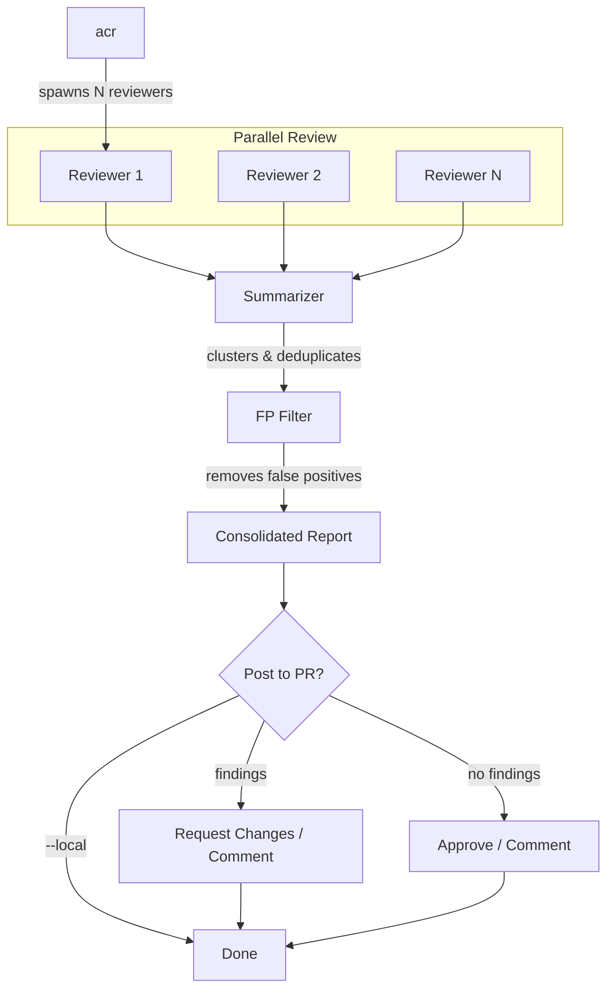

# ACR - Agentic Code Reviewer

A CLI tool that runs parallel AI-powered code reviews using LLM agents ([Codex](https://github.com/openai/codex), [Claude Code](https://github.com/anthropics/claude-code), or [Gemini CLI](https://github.com/google-gemini/gemini-cli)) and aggregates findings intelligently.

## Quick Start

```bash
# Install ACR
brew install richhaase/tap/acr

# Install at least one LLM CLI (Codex shown here)
brew install codex

# Run a review in your repo
cd your-repo
acr
```

## Prerequisites

You need **at least one** of the following LLM CLIs installed and authenticated:

| Agent | Installation |
|-------|--------------|
| Codex | [github.com/openai/codex](https://github.com/openai/codex) (default) |
| Claude Code | [github.com/anthropics/claude-code](https://github.com/anthropics/claude-code) |
| Gemini CLI | [github.com/google-gemini/gemini-cli](https://github.com/google-gemini/gemini-cli) |

Optional:
- **gh CLI** - For posting reviews to GitHub PRs. Install via `brew install gh` and authenticate with `gh auth login`

## How It Works

ACR spawns multiple parallel reviewers, each invoking your chosen LLM agent (Codex, Claude, or Gemini) independently. The parallel approach increases coverage: different reviewers may catch different issues. After all reviewers complete, ACR aggregates and clusters similar findings using an LLM summarizer, filters out likely false positives, then presents a consolidated report.



## Installation

### Homebrew (macOS)

```bash
brew install richhaase/tap/acr
```

### From Source

```bash
go install github.com/richhaase/agentic-code-reviewer/cmd/acr@latest
```

## Usage

```bash
# Review current branch against main with 5 parallel reviewers
acr

# Review with custom settings
acr --reviewers 10 --base develop --timeout 10m

# Review a specific branch in a temporary worktree
acr --worktree-branch feature/my-branch

# Review a PR from a forked repository
acr --worktree-branch username:feature-branch

# Local mode (don't post to PR)
acr --local

# Auto-approve without prompting
acr --yes

# Verbose mode (show reviewer messages as they arrive)
acr --verbose
```

### Options

| Flag                | Short | Default | Description                              |
| ------------------- | ----- | ------- | ---------------------------------------- |
| `--reviewers`       | `-r`  | 5       | Number of parallel reviewers             |
| `--concurrency`     | `-c`  | -r      | Max concurrent reviewers (see below)     |
| `--base`            | `-b`  | main    | Base ref for diff comparison             |
| `--timeout`         | `-t`  | 10m     | Timeout per reviewer                     |
| `--retries`         | `-R`  | 1       | Retry failed reviewers N times           |
| `--verbose`         | `-v`  | false   | Print agent messages in real-time        |
| `--local`           | `-l`  | false   | Skip posting to GitHub PR                |
| `--worktree-branch` | `-B`  |         | Review a branch in a temp worktree (supports `user:branch` for forks) |
| `--yes`             | `-y`  | false   | Auto-submit without prompting            |
| `--fetch/--no-fetch`|       | true    | Fetch base ref from origin before diff   |
| `--no-fp-filter`    |       | false   | Disable false positive filtering          |
| `--fp-threshold`    |       | 75      | False positive confidence threshold 1-100 |
| `--exclude-pattern` |       |         | Exclude findings matching regex (repeat)  |
| `--no-config`       |       | false   | Skip loading .acr.yaml config file        |
| `--reviewer-agent`  | `-a`  | codex   | [experimental] Agent(s) for reviews, comma-separated (codex, claude, gemini) |
| `--summarizer-agent`| `-s`  | codex   | [experimental] Agent for summarization (codex, claude, gemini) |
| `--prompt`          |       |         | [experimental] Custom review prompt (inline) |
| `--prompt-file`     |       |         | [experimental] Path to file containing review prompt |

### Concurrency Control

The `--concurrency` flag limits how many reviewers run simultaneously, independent of the total reviewer count. This helps avoid API rate limits when running many reviewers or using high retry counts.

```bash
# Run 15 total reviewers, but only 5 at a time
acr -r 15 -c 5

# With retries, -c prevents retry storms from overwhelming the API
acr -r 10 -R 3 -c 3
```

By default, concurrency equals the reviewer count (all run in parallel).

### Fork PR Support

Review pull requests from forked repositories using GitHub's `username:branch` notation:

```bash
# Review a PR from user "contributor" on branch "fix-bug"
acr --worktree-branch contributor:fix-bug
```

ACR will:
1. Query GitHub to find the open PR from that user's branch
2. Add a temporary remote pointing to the fork
3. Fetch the branch
4. Create a worktree and run the review
5. Clean up the temporary remote

This requires an open PR from the fork to the current repository. The `gh` CLI must be authenticated.

### Agent Selection (Experimental)

ACR supports multiple AI backends for code review:

| Agent | CLI | Description |
|-------|-----|-------------|
| `codex` | [Codex](https://github.com/openai/codex) | Default. Uses built-in `codex exec review` |
| `claude` | [Claude Code](https://github.com/anthropics/claude-code) | Anthropic's Claude via CLI |
| `gemini` | [Gemini CLI](https://github.com/google-gemini/gemini-cli) | Google's Gemini via CLI |

```bash
# Use Claude instead of Codex for reviews
acr --reviewer-agent claude

# Use Gemini for reviews
acr -a gemini

# Use different agents for review and summarization
acr --reviewer-agent gemini --summarizer-agent claude

# Use multiple agents in round-robin (reviewers alternate between agents)
acr -r 6 --reviewer-agent codex,claude,gemini
```

Different agents may find different issues. When multiple agents are specified (comma-separated), reviewers are assigned to agents in round-robin order. The appropriate CLI must be installed and authenticated for all selected agents.

### Custom Prompts (Experimental)

Override the default review prompt to focus on specific concerns:

```bash
# Inline prompt
acr --prompt "Review for security vulnerabilities only. Output: file:line: description"

# Prompt from file
acr --prompt-file prompts/security-review.txt
```

Effective prompts should:
- Be specific about what to look for
- Explicitly state what to skip (reduces noise)
- Specify the desired output format

The git diff is automatically appended to your prompt.

### Environment Variables

| Variable                  | Description                              |
| ------------------------- | ---------------------------------------- |
| `ACR_REVIEWERS`           | Default number of reviewers              |
| `ACR_CONCURRENCY`         | Default max concurrent reviewers         |
| `ACR_BASE_REF`            | Default base ref                         |
| `ACR_TIMEOUT`             | Default timeout (e.g., "5m" or "300")    |
| `ACR_RETRIES`             | Default retry count                      |
| `ACR_FETCH`               | Fetch base ref from origin (true/false)  |
| `ACR_FP_FILTER`           | Enable false positive filtering (true/false) |
| `ACR_FP_THRESHOLD`        | False positive confidence threshold 1-100 |
| `ACR_REVIEWER_AGENT`      | [experimental] Default reviewer agent(s), comma-separated |
| `ACR_SUMMARIZER_AGENT`    | [experimental] Default summarizer agent  |
| `ACR_REVIEW_PROMPT`       | [experimental] Default review prompt     |
| `ACR_REVIEW_PROMPT_FILE`  | [experimental] Path to default review prompt file |

## Configuration

Create `.acr.yaml` in your repository root to configure persistent settings:

```yaml
# All fields are optional - defaults shown in comments
reviewers: 5              # Number of parallel reviewers
concurrency: 5            # Max concurrent reviewers (defaults to reviewers)
base: main                # Base ref for diff comparison
timeout: 10m              # Timeout per reviewer (supports "5m", "300s", or 300)
retries: 1                # Retry failed reviewers N times
fetch: true               # Fetch base ref from origin before diff

# Experimental: Agent selection
# reviewer_agent: codex   # Single agent for reviews (codex, claude, gemini)
# reviewer_agents:        # Multiple agents for round-robin assignment
#   - codex
#   - claude
#   - gemini
# summarizer_agent: codex # Agent for summarization (codex, claude, gemini)

# Experimental: Custom review prompt (inline or file)
# review_prompt: |
#   Review for bugs only. Skip style issues.
#   Output: file:line: description
# review_prompt_file: prompts/security.txt

filters:
  exclude_patterns:       # Regex patterns to exclude from findings
    - "Next\\.js forbids"
    - "deprecated API"
    - "consider using"

fp_filter:
  enabled: true           # Enable LLM-based false positive filtering
  threshold: 75           # Confidence threshold 1-100 (100 = definitely false positive)
```

### Precedence

Configuration is resolved with the following precedence (highest to lowest):
1. CLI flags (e.g., `--reviewers 10`)
2. Environment variables (e.g., `ACR_REVIEWERS=10`)
3. Config file (`.acr.yaml`)
4. Built-in defaults

### Behavior

- Config file is loaded from the git repository root
- Missing config file is not an error (empty defaults used)
- Invalid YAML or regex patterns produce an error
- Unknown keys in config file produce a warning with "did you mean?" suggestions
- CLI `--exclude-pattern` flags are merged with config patterns (union)
- Use `--no-config` to skip loading the config file for a single run

## Exit Codes

| Code | Meaning                      |
| ---- | ---------------------------- |
| 0    | No findings                  |
| 1    | Findings found               |
| 2    | Error                        |
| 130  | Interrupted (SIGINT/SIGTERM) |

## GitHub Integration

When not in `--local` mode, ACR posts results as **PR reviews** (not comments), so they appear in the PR's Reviews tab.

### When findings are found

You'll be prompted to choose how to post the review:

```
? Post review to PR #123? [R]equest changes / [C]omment / [S]kip:
```

- **R** (default): Post as a "request changes" review
- **C**: Post as a comment-only review
- **S**: Skip posting

### When no findings (LGTM)

You'll be prompted to choose how to post the approval:

```
? Post LGTM to PR #123? [A]pprove / [C]omment / [S]kip:
```

- **A** (default): Approve the PR (checks CI status first)
- **C**: Post as a comment-only review
- **S**: Skip posting

Self-reviews (reviewing your own PR) only show Comment/Skip options since GitHub doesn't allow self-approval.

Use `--yes` to auto-submit with defaults (request-changes for findings, approve for LGTM).

Requires the `gh` CLI to be authenticated.

## Development

```bash
# List available targets
make help

# Build with version info (outputs to bin/)
make build

# Run all quality checks (format, lint, vet, staticcheck, tests)
make check

# Run tests
make test

# Run linter
make lint

# Run staticcheck
make staticcheck

# Format code
make fmt

# Clean build artifacts
make clean
```

## License

Apache License 2.0 - see [LICENSE](LICENSE)
