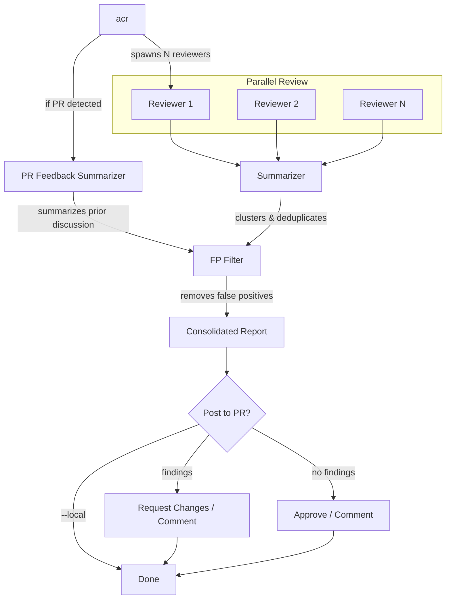

# ACR - Agentic Code Reviewer

A CLI tool that runs parallel AI-powered code reviews using LLM agents ([Antigravity CLI](https://antigravity.google/docs/cli), [Codex](https://github.com/openai/codex), [Claude Code](https://github.com/anthropics/claude-code), or Gemini CLI for enterprise users) and aggregates findings intelligently.

> **Warning: Gemini CLI is deprecated for most ACR users as of ACR v0.16.0.**
> Google is transitioning Gemini CLI users to Antigravity CLI (`agy`) and says
> Gemini CLI will stop serving requests for Google AI Pro, Ultra, and free
> Gemini Code Assist individual users on June 18, 2026. ACR still supports
> `gemini` for enterprise users whose Gemini CLI access remains available, but
> `agy` is the recommended Google agent for new and non-enterprise usage. See Google's
> [Gemini CLI to Antigravity CLI transition announcement](https://developers.googleblog.com/an-important-update-transitioning-gemini-cli-to-antigravity-cli/).

## Quick Start

```bash
brew install richhaase/tap/acr

brew install codex

cd your-repo
acr
```

## Prerequisites

You need **at least one** of the following LLM CLIs installed and authenticated:

| Agent | Installation |
|-------|--------------|
| Antigravity CLI | [antigravity.google/docs/cli](https://antigravity.google/docs/cli) |
| Codex | [github.com/openai/codex](https://github.com/openai/codex) (default) |
| Claude Code | [github.com/anthropics/claude-code](https://github.com/anthropics/claude-code) |
| Gemini CLI | Enterprise Gemini CLI installation only; deprecated for consumer use |

> **Claude Code billing note:** Anthropic announced, then paused, a billing
> change for non-interactive Claude usage. The plan would have moved
> subscription-authenticated `claude -p`/Agent SDK usage to a separate monthly
> Agent SDK credit starting June 15, 2026, but Anthropic paused it that same
> day: "For now, nothing has changed: Claude Agent SDK, `claude -p`, and
> third-party app usage still draw from your subscription's usage limits."
> When `claude` is selected, ACR invokes Claude Code in non-interactive mode
> (`claude -p`; ACR uses the equivalent `--print` flag internally) for each
> Claude reviewer and for Claude-powered summarization, false-positive
> filtering, and PR feedback, so one ACR run starts several non-interactive
> Claude sessions and can consume subscription limits quickly. Anthropic
> describes the change as paused, not cancelled, and says it will give notice
> before anything takes effect — check [Agent SDK plan billing](https://support.claude.com/en/articles/15036540-use-the-claude-agent-sdk-with-your-claude-plan)
> for current status before building Claude-based ACR usage into automation.
> API-key authentication with `ANTHROPIC_API_KEY` uses pay-as-you-go API
> billing as always. See also the [`claude -p` documentation](https://code.claude.com/docs/en/headless).

Optional:

| Tool | Installation | Purpose |
|------|--------------|---------|
| gh CLI | [cli.github.com](https://cli.github.com) | Post reviews to GitHub PRs |

## How It Works

ACR spawns multiple parallel reviewers, each invoking your chosen LLM agent (Antigravity, Codex, Claude, or enterprise Gemini) independently. The parallel approach increases coverage: different reviewers may catch different issues. After all reviewers complete, ACR aggregates and clusters similar findings using an LLM summarizer, filters out likely false positives, then presents a consolidated report.


```mermaid
graph TD
    A[acr] -->|spawns N reviewers| B
    subgraph Parallel Review
        B[Reviewer 1]
        C[Reviewer 2]
        D[Reviewer N]
    end
    A -->|if PR detected| P[PR Feedback Summarizer]
    P -->|summarizes prior discussion| F
    B & C & D --> E[Summarizer]
    E -->|clusters & deduplicates| F[FP Filter]
    F -->|removes false positives| G[Consolidated Report]
    G --> H{Post to PR?}
    H -->|--local| I[Done]
    H -->|findings| J[Request Changes / Comment]
    H -->|no findings| K[Approve / Comment]
    J --> I
    K --> I
```

## Installation

### Homebrew (macOS)

```bash
brew install richhaase/tap/acr
```

### From Source

```bash
go install github.com/richhaase/agentic-code-reviewer/cmd/acr@latest
```

## Usage

```bash
acr

acr --reviewers 10 --base develop --timeout 10m

acr --pr 123

acr --worktree-branch feature/my-branch

acr --worktree-branch username:feature-branch

acr --local

acr --yes

acr --verbose
```

### Options

| Flag                | Short | Default | Description                              |
| ------------------- | ----- | ------- | ---------------------------------------- |
| `--reviewers`       | `-r`  | 5       | Number of parallel reviewers             |
| `--concurrency`     | `-c`  | -r      | Max concurrent reviewers (see below)     |
| `--base`            | `-b`  | main    | Base ref for diff comparison             |
| `--timeout`         | `-t`  | 10m     | Timeout per reviewer                     |
| `--retries`         | `-R`  | 1       | Retry failed reviewers N times           |
| `--verbose`         | `-v`  | false   | Print agent messages in real-time        |
| `--local`           | `-l`  | false   | Skip posting to GitHub PR                |
| `--worktree-branch` | `-B`  |         | Review a branch in a temp worktree (supports `user:branch` for forks) |
| `--yes`             | `-y`  | false   | Auto-submit without prompting            |
| `--fetch/--no-fetch`|       | true    | Fetch base ref from origin before diff   |
| `--no-fp-filter`    |       | false   | Disable false positive filtering          |
| `--fp-threshold`    |       | 75      | False positive confidence threshold 1-100 |
| `--no-pr-feedback`  |       | false   | Disable PR feedback summarization         |
| `--pr-feedback-agent`|      |         | Agent for PR feedback summarization       |
| `--pr`              |       |         | Review a PR by number (fetches into temp worktree) |
| `--guidance`        |       |         | Steering context appended to review prompt (env: ACR_GUIDANCE) |
| `--guidance-file`   |       |         | Path to file containing review guidance (env: ACR_GUIDANCE_FILE) |
| `--ref-file`        |       | false   | Write diff to temp file instead of embedding in prompt (auto for large diffs) |
| `--exclude-pattern` |       |         | Exclude findings matching regex (repeat)  |
| `--no-config`       |       | false   | Skip loading .acr.yaml config file        |
| `--reviewer-agent`  | `-a`  | codex   | Agent(s) for reviews, comma-separated (agy, codex, claude, gemini) |
| `--summarizer-agent`| `-s`  | codex   | Agent for summarization (agy, codex, claude, gemini) |
| `--reviewer-model`  |       |         | LLM model for review agents (env: ACR_REVIEWER_MODEL) |
| `--summarizer-model`|       |         | LLM model for summarizer/FP filter agents (env: ACR_SUMMARIZER_MODEL) |

### Concurrency Control

The `--concurrency` flag limits how many reviewers run simultaneously, independent of the total reviewer count. This helps avoid API rate limits when running many reviewers or using high retry counts.

```bash
acr -r 15 -c 5

acr -r 10 -R 3 -c 3
```

By default, concurrency equals the reviewer count (all run in parallel).

### Fork PR Support

Review pull requests from forked repositories using GitHub's `username:branch` notation:

```bash
acr --worktree-branch contributor:fix-bug
```

ACR will:
1. Query GitHub to find the open PR from that user's branch
2. Add a temporary remote pointing to the fork
3. Fetch the branch
4. Create a worktree and run the review
5. Clean up the temporary remote

This requires an open PR from the fork to the current repository. The `gh` CLI must be authenticated.

### Watch Mode

`acr watch` reviews one PR, posts the result, then keeps watching the PR and
re-reviews until a terminal LGTM is posted or a safety bound is reached:

```bash
acr watch

acr watch --pr 123 --post-mode comment

acr watch --pr 123 --post-mode approve

acr watch --pr 123 --post-mode comment \
    --poll-interval 2m --settle-time 15m --max-reviews 5 --max-duration 8h
```

A new review cycle starts when:

- **A re-review is requested** from the authenticated `gh` user on the watched
  PR — this triggers on the next poll, without waiting for the commit quiet
  period. Requests aimed at other reviewers are ignored.
- **New commits are pushed** — a changed head starts the `--settle-time` quiet
  period (default 10m); each additional commit restarts it. The review runs
  once the head stops moving.

Every cycle fetches the PR head into a fresh temporary worktree, so local
branch state never goes stale mid-watch. Configuration (`.acr.yaml`) is read
from the checkout the watch is launched from — never from the PR head — so
run unattended watches from a trusted base-branch checkout. If the PR head
moves while a review is running, the result is discarded instead of posted,
and the new head is re-reviewed after the settle period.

Post modes control what gets posted:

| Mode | Behavior |
| --- | --- |
| `interactive` | Default. Prompts for every submission decision; requires a TTY. Declining to post an LGTM ends the watch cleanly. |
| `comment` | Unattended. Every result is posted as a comment review only — it can never request changes or approve. An LGTM is posted as an explicit LGTM comment, then the watch exits. |
| `approve` | Unattended. Findings follow the automated `--yes` rules; an LGTM approves the PR. If CI is not green, the LGTM is posted as a comment and the watch keeps polling CI, approving once it goes green for the same head. New commits invalidate the pending approval. |

`--yes`, `--local`, and `--worktree-branch` are invalid with `acr watch`:
unattended posting must be an explicit `--post-mode` decision, and the watch
always posts to the PR it is following.

The watch stops when the terminal LGTM is posted, the PR is closed or merged,
`--max-reviews` (default 10) or `--max-duration` (default 24h) is reached, or
the process is interrupted. Reaching a safety bound without an LGTM exits
non-zero.

Watch pacing can also be set in `.acr.yaml` (flags win over config):

```yaml
watch:
  poll_interval: 1m
  settle_time: 10m
  max_reviews: 10
  max_duration: 24h
```

The post mode is deliberately flag-only.

> **Cost note:** every review cycle spawns the full reviewer fleet plus the
> summarizer, false-positive filter, and PR feedback phases — roughly eight
> agent invocations per cycle at the defaults, so the default bounds allow on
> the order of 80 invocations per watched PR. If Claude Code is one of your
> agents, see the Claude billing note under Prerequisites before running
> unattended watches.

### Agent Selection

ACR supports multiple AI backends for code review:

| Agent | CLI | Description |
|-------|-----|-------------|
| `agy` | [Antigravity CLI](https://antigravity.google/docs/cli) | Google's Antigravity via CLI |
| `codex` | [Codex](https://github.com/openai/codex) | Default. Uses built-in `codex exec review` |
| `claude` | [Claude Code](https://github.com/anthropics/claude-code) | Anthropic's Claude via CLI |
| `gemini` | Gemini CLI | Deprecated for consumer use; available for enterprise Gemini CLI users |

```bash
acr --reviewer-agent claude

acr -a agy

acr -a gemini

acr --reviewer-agent agy --summarizer-agent claude

acr -r 8 --reviewer-agent agy,codex,claude

acr --reviewer-agent claude --reviewer-model sonnet-4

acr --reviewer-agent claude --reviewer-model opus-4 \
    --summarizer-agent claude --summarizer-model haiku-4
```

Antigravity CLI (`agy`) manages model selection in its own configuration; ACR does not pass `--reviewer-model` or `--summarizer-model` through to `agy`.
Gemini CLI (`gemini`) remains supported for enterprise users, but Google recommends the Antigravity CLI transition for individual users.

Different agents may find different issues. When multiple agents are specified (comma-separated), reviewers are assigned to agents in round-robin order. The appropriate CLI must be installed and authenticated for all selected agents.
If you select `claude`, ACR's non-interactive `claude -p` usage currently draws from your Claude subscription limits; Anthropic has paused (not cancelled) a plan to bill it separately. See the billing note under Prerequisites.

### Review Guidance

Steer reviews with additional context without replacing the built-in prompts:

```bash
acr --guidance "Focus on security vulnerabilities and auth issues"

acr --guidance-file .acr-guidance.md
```

Guidance is appended to the default review prompts, preserving the tuned output format and skip rules. Use it to provide domain context, focus areas, or project conventions.

### PR Feedback Summarization

When reviewing a PR (via `--pr` flag or auto-detected from the current branch), ACR can summarize prior PR discussion to improve false positive filtering. This helps avoid re-surfacing issues that have already been discussed and dismissed.

The summarizer fetches:
- PR description
- Review comments (inline code comments)
- Issue comments (general PR discussion)
- Review summaries (approve/request-changes/comment bodies)

This context is passed to the false positive filter, which can then recognize findings that were previously acknowledged as intentional or already addressed.

```bash
acr --no-pr-feedback

acr --pr-feedback-agent claude
```

PR feedback summarization runs in parallel with the reviewers and is enabled by default. It only activates when:
1. A PR is detected (via `--pr` flag or auto-detection)
2. The false positive filter is enabled

### Environment Variables

| Variable                  | Description                              |
| ------------------------- | ---------------------------------------- |
| `ACR_REVIEWERS`           | Default number of reviewers              |
| `ACR_CONCURRENCY`         | Default max concurrent reviewers         |
| `ACR_BASE_REF`            | Default base ref                         |
| `ACR_TIMEOUT`             | Default timeout (e.g., "5m" or "300")    |
| `ACR_RETRIES`             | Default retry count                      |
| `ACR_FETCH`               | Fetch base ref from origin (true/false)  |
| `ACR_FP_FILTER`           | Enable false positive filtering (true/false) |
| `ACR_FP_THRESHOLD`        | False positive confidence threshold 1-100 |
| `ACR_PR_FEEDBACK`         | Enable PR feedback summarization (true/false) |
| `ACR_PR_FEEDBACK_AGENT`   | Agent for PR feedback summarization |
| `ACR_REVIEWER_AGENT`      | Default reviewer agent(s), comma-separated |
| `ACR_SUMMARIZER_AGENT`    | Default summarizer agent  |
| `ACR_SUMMARIZER_TIMEOUT`  | Timeout for summarizer phase (e.g., "5m" or "300") |
| `ACR_FP_FILTER_TIMEOUT`   | Timeout for false positive filter phase (e.g., "5m" or "300") |
| `ACR_GUIDANCE`            | Steering context appended to review prompt |
| `ACR_GUIDANCE_FILE`       | Path to file containing review guidance    |

## Configuration

Create `.acr.yaml` in your repository root to configure persistent settings:

```yaml
reviewers: 5
concurrency: 5
base: main
timeout: 10m
retries: 1
fetch: true

summarizer_timeout: 5m
fp_filter_timeout: 5m


filters:
  exclude_patterns:
    - "Next\\.js forbids"
    - "deprecated API"
    - "consider using"

fp_filter:
  enabled: true
  threshold: 75

pr_feedback:
  enabled: true
```

### Precedence

Configuration is resolved with the following precedence (highest to lowest):
1. CLI flags (e.g., `--reviewers 10`)
2. Environment variables (e.g., `ACR_REVIEWERS=10`)
3. Config file (`.acr.yaml`)
4. Built-in defaults

### Behavior

- Config file is loaded from the git repository root
- Missing config file is not an error (empty defaults used)
- Invalid YAML or regex patterns produce an error
- Unknown keys in config file produce a warning with "did you mean?" suggestions
- CLI `--exclude-pattern` flags are merged with config patterns (union)
- Use `--no-config` to skip loading the config file for a single run

## Exit Codes

| Code | Meaning                      |
| ---- | ---------------------------- |
| 0    | No findings                  |
| 1    | Findings found               |
| 2    | Error                        |
| 130  | Interrupted (SIGINT/SIGTERM) |

## GitHub Integration

When not in `--local` mode, ACR posts results as **PR reviews** (not comments), so they appear in the PR's Reviews tab.

### When findings are found

You'll be prompted to choose how to post the review:

```
? Post review to PR #123? [R]equest changes / [C]omment / [S]kip:
```

- **R** (default): Post as a "request changes" review
- **C**: Post as a comment-only review
- **S**: Skip posting

### When no findings (LGTM)

You'll be prompted to choose how to post the approval:

```
? Post LGTM to PR #123? [A]pprove / [C]omment / [S]kip:
```

- **A** (default): Approve the PR (checks CI status first)
- **C**: Post as a comment-only review
- **S**: Skip posting

Self-reviews (reviewing your own PR) only show Comment/Skip options since GitHub doesn't allow self-approval.

Use `--yes` to auto-submit with defaults (request-changes for findings, approve for LGTM).

Requires the `gh` CLI to be authenticated.

## Development

```bash
make help

make build

make check

make test

make lint

make staticcheck

make fmt

make clean
```

See [CONTRIBUTING.md](CONTRIBUTING.md) for contribution guidelines.

## License

Apache License 2.0 - see [LICENSE](LICENSE)
